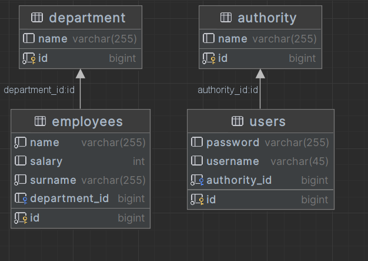

**Employee Management System README**

# Employee Management System

The Employee Management System is a Java EE-based web application that provides functionalities for managing employees and their departments. It utilizes various technologies, including EJB, Dispatcher Servlet, JWT, Liquibase, and Hibernate, to offer a robust and secure solution for employee and department management.

## Introduction

The Employee Management System is designed to simplify the process of managing employees and their departments within an organization. It offers an intuitive web-based interface that allows administrators to perform tasks like adding new employees, updating employee information, managing departments, and assigning employees to specific departments.

## Features

- User Authentication: Secure user authentication using JSON Web Tokens (JWT) to ensure authorized access to the system.
- Employee Management: Create, read, update, and delete employee records with support for essential details like name, contact information, and job position.
- Department Management: Manage departments by adding, updating, and deleting department records, along with their associated information.
- User Roles: Differentiate between administrators and regular users with appropriate roles and access permissions.
- Database Migration: Employ Liquibase for database schema management, ensuring seamless updates and version control.
- Data Persistence: Utilize Hibernate ORM to provide a reliable and efficient data persistence layer.

## Database Schema

